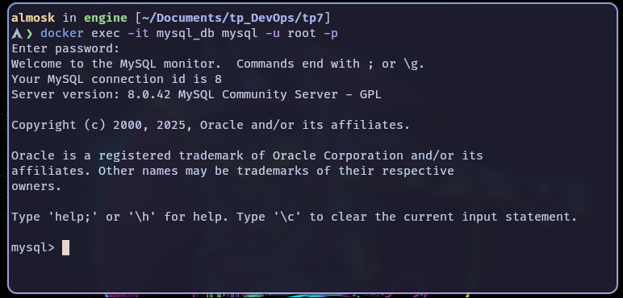

# TP cours de DevOps

<br>

## Sommaire

- [TP cours de DevOps](#tp-cours-de-devops)
  - [TP 5](##tp-5)
  - [TP 6](##tp-6)

<br>


## TP 5

**Objectif** : d&ployer une application multiconteneurs

Mise en place d'un grafana avec un prometheus :

[Dockerfile](tp5/docker-compose.yml)

```yaml
services:
  grafana:
    image: grafana/grafana-enterprise
    container_name: grafana
    restart: unless-stopped
    user: '0'
    ports:
     - '3000:3000'
    volumes:
     - 'data:/var/lib/grafana'
  prometheus:
    image: prom/prometheus
    container_name: prometheus
    restart: unless-stopped
    ports:
     - '9090:9090'
    volumes:
     - 'data:/prometheus'
volumes:
  data: {}
```

Puis lancement de l'application :

```bash
docker-compose up -d
```
On peut ensuite se connecter sur le port 3000 pour grafana et sur le port 9090 pour prometheus.


<br>

## TP 6

**Objectif**  : Deployer une application multi conteneur wordpress et nginx

J'ai mis en place un docker-compose.yml en prenant exemple sur la documentation docker hub
<https://hub.docker.com/_/wordpress>

[Dockerfile](tp6/docker-compose.yml)

```yaml
services:

  wordpress:
    image: wordpress:latest
    restart: always
    ports:
      - 8080:80
    environment:
      WORDPRESS_DB_HOST: db
      WORDPRESS_DB_USER: user
      WORDPRESS_DB_PASSWORD: pass
      WORDPRESS_DB_NAME: database
    volumes:
      - wordpress:/var/www/html

  db:
    image: mysql:8.0
    restart: always
    environment:
      MYSQL_DATABASE: database
      MYSQL_USER: user
      MYSQL_PASSWORD: pass
      MYSQL_RANDOM_ROOT_PASSWORD: '1'
    volumes:
      - db:/var/lib/mysql

volumes:
  wordpress:
  db:
```

Puis lancement de l'application :

```bash
docker-compose up -d
```

On peux ensuite se connecter au wordpress sur le port 8080


<br>

## TP 7

**Objectif** : Déployer un conteneur de base de données et
sécurisé ces données

J'ai mis en place un docker-compose.yml en prenant exemple sur la documentation docker hub de mysql
<https://hub.docker.com/_/mysql>
[Dockerfile](tp7/docker-compose.yml)

```yaml
services:
  db:
    image: mysql:8.0
    container_name: mysql_db
    environment:
      MYSQL_ROOT_PASSWORD: ${MYSQL_ROOT_PASSWORD}
      MYSQL_DATABASE: ${MYSQL_DATABASE}
      MYSQL_USER: ${MYSQL_USER}
      MYSQL_PASSWORD: ${MYSQL_PASSWORD}
    volumes:
      - db_data:/var/lib/mysql
    networks:
      - db_network
    restart: unless-stopped

volumes:
  db_data:

networks:
  db_network:
```

J'ai également mis en place un fichier .env pour stocker les variables d'environnement

[fichier .env](tp7/.env)

```bash
# Je laisse le fichier dans le repo, mais c'est une mauvaise pratique de le faire habituellement.
MYSQL_ROOT_PASSWORD=rootpass
MYSQL_DATABASE=database
MYSQL_USER=user
MYSQL_PASSWORD=sqlpass
```

Puis lancement de l'application :

```bash
docker-compose up -d
```


On peux ensuite se connecter à la base de données avec le client mysql

```bash
docker exec -it mysql_db mysql -u root -p
```

