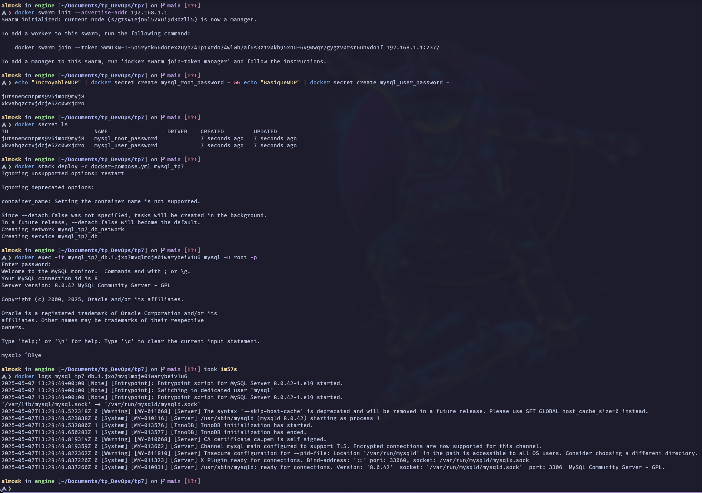

# TP cours de DevOps

<br>

## Sommaire

- [TP cours de DevOps](#tp-cours-de-devops)
  - [TP 5](#tp-5)
  - [TP 5-2](#tp-5-2)
  - [TP 6](#tp-6)
  - [TP 7](#tp-7)
  - [TP 8](#tp-8)
  - [TP 9](#tp-9)
    - [TP 9-1 Dockerfile basique](#tp-9-1-dockerfile-basique)
    - [TP 9-2 Dockerfile avec gestion des fichiers et métadonnées](#tp-9-2-dockerfile-avec-gestion-des-fichiers-et-métadonnées)
    - [TP 9-3 Dockerfile avec environnement et persistance](#tp-9-3-dockerfile-avec-environnement-et-persistance)
  - [TP 10](#tp-10)


<br>


## TP 5

**Objectif** : d&ployer une application multiconteneurs

#### Mise en place

Mise en place d'un grafana avec un prometheus :

[Dockerfile](tp5/docker-compose.yml)

```yaml
services:
  grafana:
    image: grafana/grafana-enterprise
    container_name: grafana
    restart: unless-stopped
    user: '0'
    ports:
     - '3000:3000'
    volumes:
     - 'data:/var/lib/grafana'
  prometheus:
    image: prom/prometheus
    container_name: prometheus
    restart: unless-stopped
    ports:
     - '9090:9090'
    volumes:
     - 'data:/prometheus'
volumes:
  data: {}
```

#### lancement de l'application

```bash
docker-compose up -d
```

pour l'arrêter :

```bash
docker-compose down
```

pour le supprimer :

```bash
docker rmi grafana/grafana-enterprise:latest prom/prometheus:latest && \
docker volume rm tp5_data
```

#### Démonstration

On peut ensuite se connecter sur le port 3000 pour grafana et sur le port 9090 pour prometheus.


<br>

## TP 5-2

*En relisant l'énoncé j'ai l'impression qu'il était attendu d'appeler un code local avec docker*

#### Mise en place

J'ai donc mis en place une application simple en python fastapi qui renvoie un "Hello World" sur le port 8000

[Dockerfile](tp5-2/Dockerfile)

```dockerfile
FROM python:3.13.3-alpine3.21

# Création de l'utilisateur qui executera l'application pour que ce ne soit pas root
RUN addgroup -S appgroup && adduser -S appuser -G appgroup

# Installation des dépendances depuis requirements.txt
COPY requirements.txt /app/requirements.txt
RUN pip install --no-cache-dir -r /app/requirements.txt && \
    rm -rf /root/.cache

# Copie du code source dans le conteneur
COPY app /app
WORKDIR /app

# Exposition du port 8000
EXPOSE 8000

# Passage de l'utilisateur root à appuser pour plus de sécurité
USER appuser

# Commande pour démarrer l'application
CMD ["uvicorn", "main:app", "--host", "0.0.0.0", "--port", "8000"]
```

#### Lancement de l'application

Je peux maintenant construire l'image, la lancer et vérifier que les appels API fonctionnent

```bash
docker build -t fastapi-img .
```
```bash
docker run -p 8000:8000 -d --name fastapi-app fastapi-img
```
```bash
curl http://localhost:8000/
````

Affichage des logs de l'application :

```bash
docker logs fastapi-app
```

Pour l'arrêter :

```bash
docker stop fastapi-app
```

Pour le supprimer :

```bash
docker rm fastapi-app && docker rmi fastapi-app
```

#### Démonstration


<br>

## TP 6

**Objectif**  : Deployer une application multi conteneur wordpress et nginx

#### Mise en place

J'ai mis en place un docker-compose.yml en prenant exemple sur la documentation docker hub
<https://hub.docker.com/_/wordpress>

[Dockerfile](tp6/docker-compose.yml)

```yaml
services:

  wordpress:
    image: wordpress:latest
    restart: always
    ports:
      - 8080:80
    environment:
      WORDPRESS_DB_HOST: db
      WORDPRESS_DB_USER: user
      WORDPRESS_DB_PASSWORD: pass
      WORDPRESS_DB_NAME: database
    volumes:
      - wordpress:/var/www/html

  db:
    image: mysql:8.0
    restart: always
    environment:
      MYSQL_DATABASE: database
      MYSQL_USER: user
      MYSQL_PASSWORD: pass
      MYSQL_RANDOM_ROOT_PASSWORD: '1'
    volumes:
      - db:/var/lib/mysql

volumes:
  wordpress:
  db:
```

#### Lancement de l'application

```bash
docker-compose up -d
```

pour l'arrêter :

```bash
docker-compose down
```

pour le supprimer :

```bash
docker volume rm tp6_db tp6_wordpress
```

#### Démonstration

On peux ensuite se connecter au wordpress sur le port 8080


<br>

## TP 7

**Objectif** : Déployer un conteneur de base de données et sécurisé ces données

#### Mise en place

J'ai mis en place un docker-compose.yml en prenant exemple sur la documentation docker hub de mysql
<https://hub.docker.com/_/mysql> avec une utilisation de secrets docker pour stocker les mots de passes

[Dockerfile](tp7/docker-compose.yml)

```yaml
services:
  db:
    image: mysql:8.0
    container_name: mysql_db
    environment:
      MYSQL_ROOT_PASSWORD_FILE: /run/secrets/mysql_root_password
      MYSQL_PASSWORD_FILE: /run/secrets/mysql_user_password
      MYSQL_DATABASE: database
      MYSQL_USER: user
    volumes:
      - db_data:/var/lib/mysql
    networks:
      - db_network
    restart: unless-stopped
    secrets:
      - mysql_root_password
      - mysql_user_password

volumes:
  db_data:

networks:
  db_network:

secrets:
  mysql_root_password:
    external: true
  mysql_user_password:
    external: true
```

#### Lancement de l'application

J'ai mis en place les secrets avec docker swarm:

```bash
docker swarm init
```

*Il peut être nécéssaire de spécifier l'adresse IP avec l'option :* `--advertise-addr`

```bash
echo "IncroyableMDP" | docker secret create mysql_root_password -
```

```bash
echo "BasiqueMDP" | docker secret create mysql_user_password -
```

On peux vérifier que les secrets sont bien créés avec la commande suivante :

```bash
docker secret ls
```

Et enfin on peut lancer l'application :

```bash
docker stack deploy -c docker-compose.yml mysql_tp7
```

Pour verifier que tout fonctionne, on peux ce connecter :

```bash
docker exec -it mysql_tp7_db.1.<Identifiant_swarm> mysql -u root -p
```

*la touche Tab pour réccupérer l'ID swarm rapidement*

où verifier les logs du conteneur :

```bash
docker logs mysql_tp7_db
```

pour l'arrêter :

```bash
docker stack rm mysql_tp7
```
pour supprimer les secrets :

```bash
docker secret rm mysql_root_password && docker secret rm mysql_user_password
```

```bash
docker swarm leave --force
```

```bash
docker volume rm mysql_tp7_db_data
```

#### Remarque

- On pourrait pousser les bonnes pratiques en mettant en place un vault pour stocker les secrets couplé avec ansible. Mais le TP n'a pas l'air de demander ça, et doit durer 15 minutes.

- L'application est très basique, le but étais de tester la mise en place de secrets docker

#### Démonstration



<br>

## TP 8

**Objectif** : Déployer un conteneur de base de données et
sécurisé ces données (avec un .env)

#### Mise en place

J'ai mis en place un docker-compose.yml en prenant exemple sur la documentation docker hub de mysql
<https://hub.docker.com/_/mysql>
[Dockerfile](tp8/docker-compose.yml)

```yaml
services:
  db:
    image: mysql:8.0
    container_name: mysql_db
    environment:
      MYSQL_ROOT_PASSWORD: ${MYSQL_ROOT_PASSWORD}
      MYSQL_DATABASE: ${MYSQL_DATABASE}
      MYSQL_USER: ${MYSQL_USER}
      MYSQL_PASSWORD: ${MYSQL_PASSWORD}
    volumes:
      - db_data:/var/lib/mysql
    networks:
      - db_network
    restart: unless-stopped

volumes:
  db_data:

networks:
  db_network:
```

J'ai également mis en place un fichier .env pour stocker les variables d'environnement

[fichier .env](tp8/.env)

```bash
# Je laisse le fichier dans le repo, mais c'est une mauvaise pratique de le faire habituellement.
MYSQL_ROOT_PASSWORD=rootpass
MYSQL_DATABASE=database
MYSQL_USER=user
MYSQL_PASSWORD=sqlpass
```

#### Lancement de l'application


```bash
docker-compose up -d
```

pour l'arrêter :

```bash
docker-compose down
```

pour le supprimer :

```bash
docker rmi mysql:8.0 && docker volume rm tp8_db_data
```

#### Démonstration


On peux ensuite se connecter à la base de données avec le client mysql

```bash
docker exec -it mysql_db mysql -u root -p
```


<br>

## TP 9

**Objectif** : Plusieurs Dockerfile à mettre en place

<hr>

### TP 9-1 Dockerfile basique

**Objectif** : Créer un Dockerfile basique d'un nginx sur une image ubuntu

#### Mise en place
J'ai mis en place un dockerfile basique d'un nginx sur une image ubuntu<br>
*Je n'ai pas mis de docker-compose.yml pour un seul conteneur*

[Dockerfile](tp9/tp9-1/Dockerfile)

```dockerfile

```yaml
FROM ubuntu:latest

# Installation de nginx
RUN apt-get update && \
    apt-get install -y nginx && \
    apt-get clean

# Expose port 80
EXPOSE 80

# Start
CMD ["nginx", "-g", "daemon off;"]
```

#### Lancement de l'application


```bash
docker build -t tp9-1 .
```

Et pour lancer le conteneur :

```bash
docker run -d -p 80:80 --name tp9-1-app tp9-1
```

Pour l'arrêter :

```bash
docker stop tp9-1-app
```

Pour le supprimer :

```bash
docker rm tp9-1-app && docker rmi tp9-1
```

#### Démonstration

Après ça on peux se connecter.


<hr>

### TP 9-2 Dockerfile avec gestion des fichiers et métadonnées

**Objectif** : Ajouter des la complxité avec une base web

#### Mise en place

[Dockerfile](tp9/tp9-2/Dockerfile)

```dockerfile
FROM ubuntu:latest

# Quelques métadonnées
LABEL maintainer="Alvin <alvinkita@edu.igencia.com>"
LABEL description="Application pour TP9-2"
LABEL version="0.1"

# Installation de nginx
RUN apt-get update && \
    apt-get install -y nginx && \
    apt-get clean

# Création du dossier de travail
WORKDIR /var/www/html

# Copie des fichiers de l'application
COPY webapp/ .

# Expose port 80
EXPOSE 80

# Start
CMD ["nginx", "-g", "daemon off;"]
```

avec un dossier webapp contenant un index.html avec un page (très) simple

#### Lancement de l'application

```bash

pour lancer l'application :

```bash
docker build -t tp9-2 .
```

```bash
docker run -d -p 80:80 --name tp9-2-app tp9-2
```

Pour l'arrêter :

```bash
docker stop tp9-2-app
```

Pour le supprimer :

```bash
docker rm tp9-2-app && docker rmi tp9-2
```

#### Démonstration

Le résultat ci dessous avec un test curl :


<hr>

### TP 9-3 Dockerfile avec environnement et persistance

**Objectif** : Déployer une application Python Flask utilisant une variable d'environnement pour sa configuration, avec un dossier pour la persistance des logs

*Réalisé à l'aide de la documentation de Flask :* https://flask.palletsprojects.com/en/stable/quickstart/#a-minimal-application

#### Mise en place

Le code est découpé en plusieurs fichiers : <br>


- La racine du projet contenant les fichier de configuration de docker

[Dockerfile](tp9/tp9-3/Dockerfile)
```dockerfile
FROM python:3.13.3-alpine3.21

COPY requirements.txt /app/requirements.txt

# La bonne partiques est d'utiliser q'une seule commande RUN.
# Mais pour une meilleur lisibilité des étapes, je vais en utiliser plusieurs.  

# Installation des dépendances depuis requirements.txt
RUN pip install --no-cache-dir -r /app/requirements.txt && \
    rm -rf /root/.cache

# Création de l'utilisateur qui executera l'application pour que ce ne soit pas root
RUN addgroup -S appgroup && adduser -S appuser -G appgroup

# Création du dossier de logs et attribution des droits à l'utilisateur appuser
RUN mkdir -p /logs && chown appuser:appgroup /logs
VOLUME ["/logs"]
    
# Copie du code source dans le conteneur
COPY app /app

EXPOSE 5000

# Variables d'environnement pour Flask
ENV FLASK_ENV=production

# Passage de l'utilisateur root à appuser pour plus de sécurité
USER appuser

CMD ["flask", "--app", "app", "run", "--host=0.0.0.0"]
```
[requirements.txt](tp9/tp9-3/requirements.txt)
```text
flask
```

[.env](tp9/tp9-3/.env)
```text
# Je laisse le fichier dans le repo, mais c'est une mauvaise pratique de le faire habituellement.
FLASK_SECRET_KEY=Ma_cle_super_secrete
```

[docker-compose.yml](tp9/tp9-3/docker-compose.yml)
```yaml
services:
  flask:
    build: .
    ports:
      - "5000:5000"
    env_file:
      - .env
    volumes:
      - ./logs:/logs
```

<br>

- Le dossier app contenant le code de l'application flask

[app.py](tp9/tp9-3/app/__init__.py)
```python
import os
import logging
from flask import Flask

logging.basicConfig(filename='/logs/app.log', level=logging.INFO)

app = Flask(__name__)
app.config['SECRET_KEY'] = os.environ.get('FLASK_SECRET_KEY', 'defaultkey')

@app.route("/")
def hello_world():
    return "<p>Hello, World!</p>"

```

<br>

- Le dossier logs contenant les logs du volume persistant de l'application

[logs](tp9/tp9-3/logs/app.log)

*A noter que au premier lancement de l'application j'ai eu une erreur :*<br> `flask-1  | PermissionError: [Errno 13] Permission denied: '/logs/app.log'`

*Que j'ai corriger modifiant les droits d'acces au dossier des logs :*
```bash
sudo chmod 777 logs
```

#### Lancement de l'application

```bash
docker-compose up -d
```
Pour l'arrêter :
```bash
docker-compose down
```

Pour le supprimer :
```bash
docker rmi tp9-3-flask
```

#### Démonstration


- Au lancement de m'application on a bien le conteneur de logs qui est monté

- Et en consultant le fichier des logs on retrouve les logs actuel, et du lancement précédent

<br>

## TP 10

**Objectif** : Manipuler Azure

*Je vais profiter de cet exercice pour utiliser Terraform pour le déploiement*

### Pré-requis

- Terraform
- Azure CLI

Authentification avec Azure CLI
*Je me suis appuyé sur la documentation terraform :* https://registry.terraform.io/providers/hashicorp/azurerm/latest/docs/guides/azure_cli

```bash
az login
```
Une fois connecté, on peux vérifier que l'on est bien authentifié avec la commande suivante :

```bash
az account list
```


### TP 10-1 Créer une machine virtuelle azure

#### Mise en place

Je me suis appuyé sur la documentation Azure très complète pour mettre en place la configuration de la machine virtuelle :<br> https://learn.microsoft.com/fr-fr/azure/virtual-machines/linux/quick-create-terraform?tabs=azure-cli<br>
*J'ai changé le nom de la machine virtuelle, le type de stockage qui ne fonctionnait pas, et la localisation pour mettre la France. Ainsi que quelques variables de confort comme le nom d'utilisateur, où l'ajout de la clé ssh directement dans les fichier locaux du PC pour pouvoir acceder à la VM depuis mon PC sans manipulations supplémentaire.*

Il y'a plusieurs fichers pour la configuration qui sont les suivants :

- [main.tf](tp10/tp10-1/main.tf)<br>
  On retrouve la configuration de la machine virtuelle dans la ressource : `azurerm_linux_virtual_machine" "my_terraform_vm`

- [variables.tf](tp10/tp10-1/variables.tf)
- [outputs.tf](tp10/tp10-1/outputs.tf)
- [ssh.tf](tp10/tp10-1/ssh.tf)
- [provider.tf](tp10/tp10-1/provider.tf)

Tous accessible dans le dossier [tp10/tp10-1](tp10/tp10-1)

#### Lancement de l'application

Initialisation de terraform

```bash
terraform init -upgrade
```

Mise en forme de la configuration

```bash
terraform fmt
```

verification de la configuration pendant le developpement

```bash
terraform plan
```

Une fois que tout est bon, on peux lancer la création de la machine virtuelle

```bash
terraform apply
```

Toutes les ressources sont créées, on y retrouve notement la machine virtuelle et ces caractéristiques


Une fois terminé on retrouve bien la machine sur Azure :


Et je peux me connecter à la machine virtuelle en ssh avec la commande suivante :


Cette configuration sera la base pour la suite du TP.
