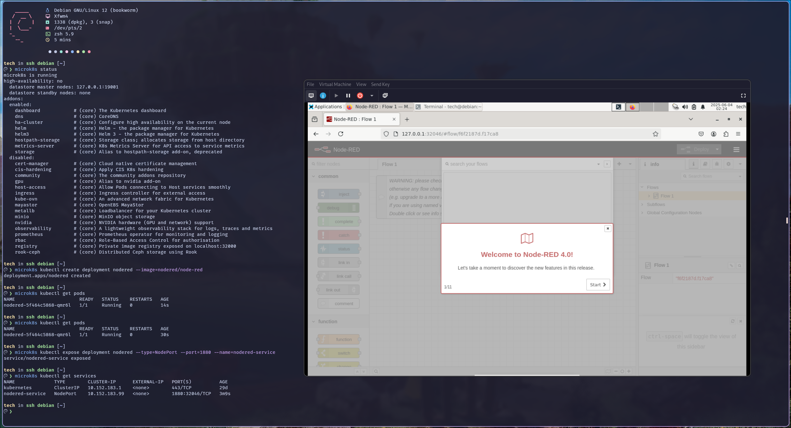
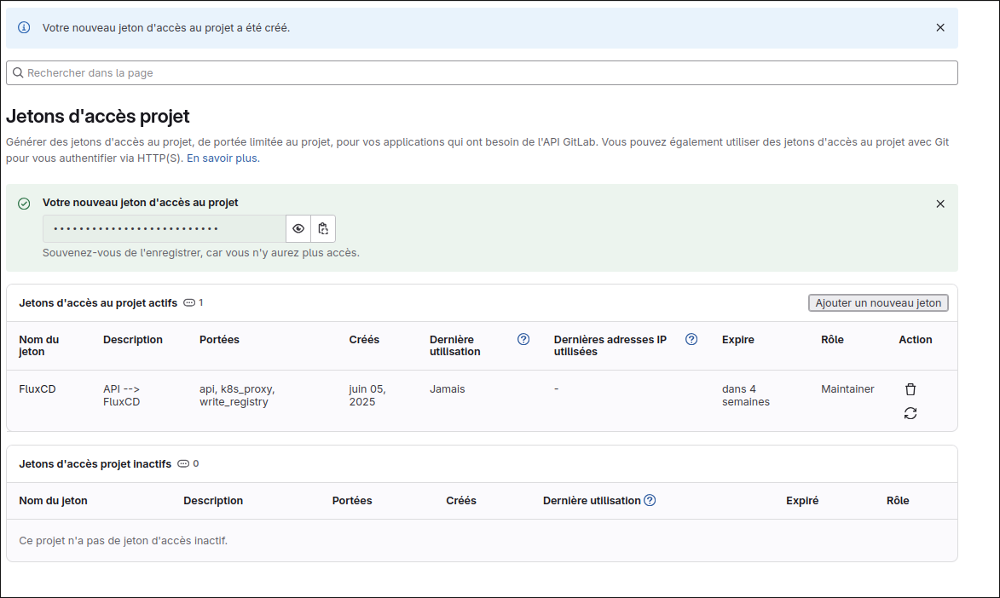
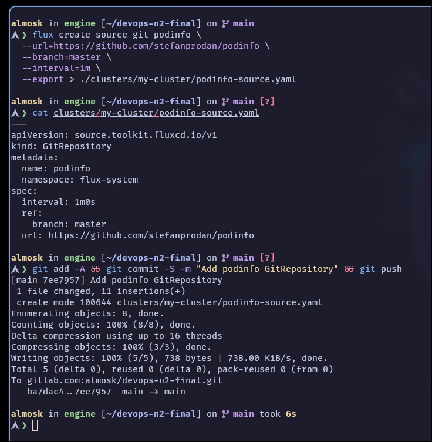

# TP cours de DevOps

<br>

## Sommaire

- [TP cours de DevOps](#tp-cours-de-devops)
  - [Introduction](#introduction)
  - [TP 5](#tp-5)
  - [TP 5-2](#tp-5-2)
  - [TP 6](#tp-6)
  - [TP 7](#tp-7)
  - [TP 8](#tp-8)
  - [TP 9](#tp-9)
    - [TP 9-1 Dockerfile basique](#tp-9-1-dockerfile-basique)
    - [TP 9-2 Dockerfile avec gestion des fichiers et métadonnées](#tp-9-2-dockerfile-avec-gestion-des-fichiers-et-métadonnées)
    - [TP 9-3 Dockerfile avec environnement et persistance](#tp-9-3-dockerfile-avec-environnement-et-persistance)
  - [TP 10](#tp-10)
    - [TP 10-1 Créer une machine virtuelle azure](#tp-10-1-créer-une-machine-virtuelle-azure)
    - [TP 10-2 Héberger un site web statique sur Azure Storage](#tp-10-2-héberger-un-site-web-statique-sur-azure-storage)
    - [TP 10-3 Connecter deux réseaux virtuels avec peering](#tp-10-3-connecter-deux-réseaux-virtuels-avec-peering)
  - [TP 11](#tp-11)
  - [Annexe: mise en place de l'agent sur Docker](azp-agent-in-docker/README.md)
  - [TP 12 : Conteneurisation](#tp-12--conteneurisation)
  - [TP 13 : Push d'une image sur docker hub](#tp-13--push-dune-image-sur-docker-hub)
  - [TP 14 : Déploiement d'un environnement](#tp-14--déploiement-dun-environnement)
    - [TP 14-1 : Deploiement d'un site web par command et par manifest](#tp-14-1--deploiement-dun-site-web-par-command-et-par-manifest)
    - [TP 14-2 : Déploiement](#tp-14-2--déploiement)
    - [TP 14-3 : Vérification](#tp-14-3--vérification)
    - [TP 14-4 : Déployer le logiciel Lens](#tp-14-4--déployer-le-logiciel-lens)
  - [TP 15 : Déploiement de la supervision du cluster](#tp-15--déploiement-de-la-supervision-du-cluster)
    - [TP 15-1 : Déploiement d’un site web par command et par manifest](#tp-15-1--déploiement-dun-site-web-par-command-et-par-manifest)
    - [TP 15-2 : Tableau de bords](#tp-15-2--tableau-de-bords)
  - [TP 16 : fluxcd - gitlab](#tp-16--fluxcd---gitlab)
    - [TP 16-1 : Installer FluxCD](#tp-16-1--installer-fluxcd)
    - [TP 16-2 : Initialiser le cluster avec un nouveau projet](#tp-16-2--initialiser-le-cluster-avec-un-nouveau-projet)
  - [TP 17 : Final](#tp-17--final)
    - [TP 17-1 : Déployer un cluster sur Azure](#tp-17-1--déployer-un-cluster-sur-azure)
    - [TP 17-2 : Installer FluxCD](#tp-17-2--installer-fluxcd)
    - [TP 17-3 : Initialiser le cluster avec un nouveau projet](#tp-17-3--initialiser-le-cluster-avec-un-nouveau-projet)

<br>


## Introduction

Chaque partie est lié à un TP d'on les fichiers sont dans le dossier `tpX` correspondant <br>

Les différents codes sont prévus pour être lancé dans un terminal Linux ou WSL2 dans le repertoire du TP correspondant.

Les commandes sont prévu pour fonctionner sur un OS ArchLinux. Je ne pense pas qu'il y ai des différences avec les autres distributions, mais je le précise au cas où.

Mon utilisateur fais partie du groupe docker, donc je n'ai pas besoin de rajouter `sudo` devant les commandes docker. je ne le précise pas dans les commandes.


## TP 5

**Objectif** : déployer une application multiconteneurs

#### Mise en place

Mise en place d'un grafana avec un prometheus :

[Dockerfile](tp5/docker-compose.yml)

```yaml
services:
  grafana:
    image: grafana/grafana-enterprise
    container_name: grafana
    restart: unless-stopped
    user: '0'
    ports:
     - '3000:3000'
    volumes:
     - 'data:/var/lib/grafana'
  prometheus:
    image: prom/prometheus
    container_name: prometheus
    restart: unless-stopped
    ports:
     - '9090:9090'
    volumes:
     - 'data:/prometheus'
volumes:
  data: {}
```

#### lancement de l'application

```bash
docker-compose up -d
```

pour l'arrêter :

```bash
docker-compose down
```

pour le supprimer :

```bash
docker rmi grafana/grafana-enterprise:latest prom/prometheus:latest && \
docker volume rm tp5_data
```

#### Démonstration

On peut ensuite se connecter sur le port 3000 pour grafana et sur le port 9090 pour prometheus.


<br>

## TP 5-2

*En relisant l'énoncé j'ai l'impression qu'il était attendu d'appeler un code local avec docker*

#### Mise en place

J'ai donc mis en place une application simple en python fastapi qui renvoie un "Hello World" sur le port 8000

[Dockerfile](tp5-2/Dockerfile)

```dockerfile
FROM python:3.13.3-alpine3.21

# Création de l'utilisateur qui executera l'application pour que ce ne soit pas root
RUN addgroup -S appgroup && adduser -S appuser -G appgroup

# Installation des dépendances depuis requirements.txt
COPY requirements.txt /app/requirements.txt
RUN pip install --no-cache-dir -r /app/requirements.txt && \
    rm -rf /root/.cache

# Copie du code source dans le conteneur
COPY app /app
WORKDIR /app

# Exposition du port 8000
EXPOSE 8000

# Passage de l'utilisateur root à appuser pour plus de sécurité
USER appuser

# Commande pour démarrer l'application
CMD ["uvicorn", "main:app", "--host", "0.0.0.0", "--port", "8000"]
```

#### Lancement de l'application

Je peux maintenant construire l'image, la lancer et vérifier que les appels API fonctionnent

```bash
docker build -t fastapi-img .
```
```bash
docker run -p 8000:8000 -d --name fastapi-app fastapi-img
```
```bash
curl http://localhost:8000/
````

Affichage des logs de l'application :

```bash
docker logs fastapi-app
```

Pour l'arrêter :

```bash
docker stop fastapi-app
```

Pour le supprimer :

```bash
docker rm fastapi-app && docker rmi fastapi-app
```

#### Démonstration


<br>

## TP 6

**Objectif**  : Deployer une application multi conteneur wordpress et nginx

#### Mise en place

J'ai mis en place un docker-compose.yml en prenant exemple sur la documentation docker hub
<https://hub.docker.com/_/wordpress>

[Dockerfile](tp6/docker-compose.yml)

```yaml
services:

  wordpress:
    image: wordpress:latest
    restart: always
    ports:
      - 8080:80
    environment:
      WORDPRESS_DB_HOST: db
      WORDPRESS_DB_USER: user
      WORDPRESS_DB_PASSWORD: pass
      WORDPRESS_DB_NAME: database
    volumes:
      - wordpress:/var/www/html

  db:
    image: mysql:8.0
    restart: always
    environment:
      MYSQL_DATABASE: database
      MYSQL_USER: user
      MYSQL_PASSWORD: pass
      MYSQL_RANDOM_ROOT_PASSWORD: '1'
    volumes:
      - db:/var/lib/mysql

volumes:
  wordpress:
  db:
```

#### Lancement de l'application

```bash
docker-compose up -d
```

pour l'arrêter :

```bash
docker-compose down
```

pour le supprimer :

```bash
docker volume rm tp6_db tp6_wordpress
```

#### Démonstration

On peux ensuite se connecter au wordpress sur le port 8080


<br>

## TP 7

**Objectif** : Déployer un conteneur de base de données et sécurisé ces données

#### Mise en place

J'ai mis en place un docker-compose.yml en prenant exemple sur la documentation docker hub de mysql
<https://hub.docker.com/_/mysql> avec une utilisation de secrets docker pour stocker les mots de passes

[Dockerfile](tp7/docker-compose.yml)

```yaml
services:
  db:
    image: mysql:8.0
    container_name: mysql_db
    environment:
      MYSQL_ROOT_PASSWORD_FILE: /run/secrets/mysql_root_password
      MYSQL_PASSWORD_FILE: /run/secrets/mysql_user_password
      MYSQL_DATABASE: database
      MYSQL_USER: user
    volumes:
      - db_data:/var/lib/mysql
    networks:
      - db_network
    restart: unless-stopped
    secrets:
      - mysql_root_password
      - mysql_user_password

volumes:
  db_data:

networks:
  db_network:

secrets:
  mysql_root_password:
    external: true
  mysql_user_password:
    external: true
```

#### Lancement de l'application

J'ai mis en place les secrets avec docker swarm:

```bash
docker swarm init
```

*Il peut être nécéssaire de spécifier l'adresse IP avec l'option :* `--advertise-addr`

```bash
echo "IncroyableMDP" | docker secret create mysql_root_password -
```

```bash
echo "BasiqueMDP" | docker secret create mysql_user_password -
```

On peux vérifier que les secrets sont bien créés avec la commande suivante :

```bash
docker secret ls
```

Et enfin on peut lancer l'application :

```bash
docker stack deploy -c docker-compose.yml mysql_tp7
```

Pour verifier que tout fonctionne, on peux ce connecter :

```bash
docker exec -it mysql_tp7_db.1.<Identifiant_swarm> mysql -u root -p
```

*la touche Tab pour réccupérer l'ID swarm rapidement*

où verifier les logs du conteneur :

```bash
docker logs mysql_tp7_db
```

pour l'arrêter :

```bash
docker stack rm mysql_tp7
```
pour supprimer les secrets :

```bash
docker secret rm mysql_root_password && docker secret rm mysql_user_password
```

```bash
docker swarm leave --force
```

```bash
docker volume rm mysql_tp7_db_data
```

#### Remarque

- On pourrait pousser les bonnes pratiques en mettant en place un vault pour stocker les secrets couplé avec ansible. Mais le TP n'a pas l'air de demander ça, et doit durer 15 minutes.

- L'application est très basique, le but étais de tester la mise en place de secrets docker

#### Démonstration


<br>

## TP 8

**Objectif** : Déployer un conteneur de base de données et
sécurisé ces données (avec un .env)

#### Mise en place

J'ai mis en place un docker-compose.yml en prenant exemple sur la documentation docker hub de mysql
<https://hub.docker.com/_/mysql>
[Dockerfile](tp8/docker-compose.yml)

```yaml
services:
  db:
    image: mysql:8.0
    container_name: mysql_db
    environment:
      MYSQL_ROOT_PASSWORD: ${MYSQL_ROOT_PASSWORD}
      MYSQL_DATABASE: ${MYSQL_DATABASE}
      MYSQL_USER: ${MYSQL_USER}
      MYSQL_PASSWORD: ${MYSQL_PASSWORD}
    volumes:
      - db_data:/var/lib/mysql
    networks:
      - db_network
    restart: unless-stopped

volumes:
  db_data:

networks:
  db_network:
```

J'ai également mis en place un fichier .env pour stocker les variables d'environnement

[fichier .env](tp8/.env)

```bash
# Je laisse le fichier dans le repo, mais c'est une mauvaise pratique de le faire habituellement.
MYSQL_ROOT_PASSWORD=rootpass
MYSQL_DATABASE=database
MYSQL_USER=user
MYSQL_PASSWORD=sqlpass
```

#### Lancement de l'application


```bash
docker-compose up -d
```

pour l'arrêter :

```bash
docker-compose down
```

pour le supprimer :

```bash
docker rmi mysql:8.0 && docker volume rm tp8_db_data
```

#### Démonstration


On peux ensuite se connecter à la base de données avec le client mysql

```bash
docker exec -it mysql_db mysql -u root -p
```


<br>

## TP 9

**Objectif** : Plusieurs Dockerfile à mettre en place

<hr>

### TP 9-1 Dockerfile basique

**Objectif** : Créer un Dockerfile basique d'un nginx sur une image ubuntu

#### Mise en place
J'ai mis en place un dockerfile basique d'un nginx sur une image ubuntu<br>
*Je n'ai pas mis de docker-compose.yml pour un seul conteneur*

[Dockerfile](tp9/tp9-1/Dockerfile)

```dockerfile

```yaml
FROM ubuntu:latest

# Installation de nginx
RUN apt-get update && \
    apt-get install -y nginx && \
    apt-get clean

# Expose port 80
EXPOSE 80

# Start
CMD ["nginx", "-g", "daemon off;"]
```

#### Lancement de l'application


```bash
docker build -t tp9-1 .
```

Et pour lancer le conteneur :

```bash
docker run -d -p 80:80 --name tp9-1-app tp9-1
```

Pour l'arrêter :

```bash
docker stop tp9-1-app
```

Pour le supprimer :

```bash
docker rm tp9-1-app && docker rmi tp9-1
```

#### Démonstration

Après ça on peux se connecter.


<hr>

### TP 9-2 Dockerfile avec gestion des fichiers et métadonnées

**Objectif** : Ajouter des la complxité avec une base web

#### Mise en place

[Dockerfile](tp9/tp9-2/Dockerfile)

```dockerfile
FROM ubuntu:latest

# Quelques métadonnées
LABEL maintainer="Alvin <alvinkita@edu.igencia.com>"
LABEL description="Application pour TP9-2"
LABEL version="0.1"

# Installation de nginx
RUN apt update && \
    apt install -y nginx && \
    apt clean

# Création du dossier de travail
WORKDIR /var/www/html

# Copie des fichiers de l'application
COPY webapp/ .

# Expose port 80
EXPOSE 80

# Start
CMD ["nginx", "-g", "daemon off;"]
```

avec un dossier webapp contenant un index.html avec un page (très) simple

#### Lancement de l'application

```bash

pour lancer l'application :

```bash
docker build -t tp9-2 .
```

```bash
docker run -d -p 80:80 --name tp9-2-app tp9-2
```

Pour l'arrêter :

```bash
docker stop tp9-2-app
```

Pour le supprimer :

```bash
docker rm tp9-2-app && docker rmi tp9-2
```

#### Démonstration

Le résultat ci dessous avec un test curl :


<hr>

### TP 9-3 Dockerfile avec environnement et persistance

**Objectif** : Déployer une application Python Flask utilisant une variable d'environnement pour sa configuration, avec un dossier pour la persistance des logs

*Réalisé à l'aide de la documentation de Flask :* https://flask.palletsprojects.com/en/stable/quickstart/#a-minimal-application

#### Mise en place

Le code est découpé en plusieurs fichiers : <br>


- La racine du projet contenant les fichier de configuration de docker

[Dockerfile](tp9/tp9-3/Dockerfile)
```dockerfile
FROM python:3.13.3-alpine3.21

COPY requirements.txt /app/requirements.txt

# La bonne partiques est d'utiliser q'une seule commande RUN.
# Mais pour une meilleur lisibilité des étapes, je vais en utiliser plusieurs.  

# Installation des dépendances depuis requirements.txt
RUN pip install --no-cache-dir -r /app/requirements.txt && \
    rm -rf /root/.cache

# Création de l'utilisateur qui executera l'application pour que ce ne soit pas root
RUN addgroup -S appgroup && adduser -S appuser -G appgroup

# Création du dossier de logs et attribution des droits à l'utilisateur appuser
RUN mkdir -p /logs && chown appuser:appgroup /logs
VOLUME ["/logs"]
    
# Copie du code source dans le conteneur
COPY app /app

EXPOSE 5000

# Variables d'environnement pour Flask
ENV FLASK_ENV=production

# Passage de l'utilisateur root à appuser pour plus de sécurité
USER appuser

CMD ["flask", "--app", "app", "run", "--host=0.0.0.0"]
```
[requirements.txt](tp9/tp9-3/requirements.txt)
```text
flask
```

[.env](tp9/tp9-3/.env)
```text
# Je laisse le fichier dans le repo, mais c'est une mauvaise pratique de le faire habituellement.
FLASK_SECRET_KEY=Ma_cle_super_secrete
```

[docker-compose.yml](tp9/tp9-3/docker-compose.yml)
```yaml
services:
  flask:
    build: .
    ports:
      - "5000:5000"
    env_file:
      - .env
    volumes:
      - ./logs:/logs
```

<br>

- Le dossier app contenant le code de l'application flask

[app.py](tp9/tp9-3/app/__init__.py)
```python
import os
import logging
from flask import Flask

logging.basicConfig(filename='/logs/app.log', level=logging.INFO)

app = Flask(__name__)
app.config['SECRET_KEY'] = os.environ.get('FLASK_SECRET_KEY', 'defaultkey')

@app.route("/")
def hello_world():
    return "<p>Hello, World!</p>"

```

<br>

- Le dossier logs contenant les logs du volume persistant de l'application

[logs](tp9/tp9-3/logs/app.log)

*A noter que au premier lancement de l'application j'ai eu une erreur :*<br> `flask-1  | PermissionError: [Errno 13] Permission denied: '/logs/app.log'`

*Que j'ai corriger modifiant les droits d'acces au dossier des logs :*
```bash
sudo chmod 777 logs
```

#### Lancement de l'application

```bash
docker-compose up -d
```
Pour l'arrêter :
```bash
docker-compose down
```

Pour le supprimer :
```bash
docker rmi tp9-3-flask
```

#### Démonstration


- Au lancement de m'application on a bien le conteneur de logs qui est monté

- Et en consultant le fichier des logs on retrouve les logs actuel, et du lancement précédent

<br>

## TP 10

**Objectif** : Manipuler Azure

*Je vais profiter de cet exercice pour utiliser Terraform pour le déploiement*

### Pré-requis

- Terraform
- Azure CLI

Authentification avec Azure CLI
*Je me suis appuyé sur la documentation terraform :* https://registry.terraform.io/providers/hashicorp/azurerm/latest/docs/guides/azure_cli

```bash
az login
```
Une fois connecté, on peux vérifier que l'on est bien authentifié avec la commande suivante :

```bash
az account list
```


<br>

### TP 10-1 Créer une machine virtuelle azure

#### Mise en place

Je me suis appuyé sur la documentation Azure très complète pour mettre en place la configuration de la machine virtuelle :<br> https://learn.microsoft.com/fr-fr/azure/virtual-machines/linux/quick-create-terraform?tabs=azure-cli<br>
*J'ai changé le nom de la machine virtuelle, le type de stockage qui ne fonctionnait pas, et la localisation pour mettre la France. Ainsi que quelques variables de confort comme le nom d'utilisateur, où l'ajout de la clé ssh directement dans les fichier locaux du PC pour pouvoir acceder à la VM depuis mon PC sans manipulations supplémentaire.*

Il y'a plusieurs fichers pour la configuration qui sont les suivants :

- [main.tf](tp10/tp10-1/main.tf)<br>
  On retrouve la configuration de la machine virtuelle dans la ressource : `azurerm_linux_virtual_machine" "my_terraform_vm`

- [variables.tf](tp10/tp10-1/variables.tf)
- [outputs.tf](tp10/tp10-1/outputs.tf)
- [ssh.tf](tp10/tp10-1/ssh.tf)
- [provider.tf](tp10/tp10-1/provider.tf)

Tous accessible dans le dossier [tp10/tp10-1](tp10/tp10-1)

#### Lancement de l'application

Initialisation de terraform

```bash
terraform init -upgrade
```

Mise en forme de la configuration

```bash
terraform fmt
```

verification de la configuration pendant le developpement

```bash
terraform plan
```

Une fois que tout est bon, on peux lancer la création de la machine virtuelle

```bash
terraform apply
```

#### Démonstration

Toutes les ressources sont créées, on y retrouve notement la machine virtuelle et ces caractéristiques


Une fois terminé on retrouve bien la machine sur Azure :


Et je peux me connecter à la machine virtuelle en ssh avec la commande suivante :


Cette configuration sera la base pour la suite du TP.
<br>
### TP 10-2 Héberger un site web statique sur Azure Storage

#### Mise en place

Suite au TP 10-1, le compte de stockage est en place :


Je vais donc mettre en place un site web statique sur le compte de stockage créé précédement, en ajoutant à la configuration terraform la ressource `azurerm_storage_account_static_website`<br>
*Documentation :* https://registry.terraform.io/providers/hashicorp/azurerm/latest/docs/resources/storage_account_static_website

J'ai rajouté la resources suivante dans le fichier [main.tf](tp10/main.tf)

```tf
resource "azurerm_storage_account_static_website" "static_site" {
  storage_account_id = azurerm_storage_account.my_storage_account.id
  index_document     = "index.html"
  error_404_document = "404.html"
}
```

Et également un petit template web simple dans le dossier [web](tp10/web) contenant un index.html et un 404.html

Template que j'upload en blob dans le compte de stockage avec la ressource `azurerm_storage_blob`<br>
*Documentation :* https://registry.terraform.io/providers/hashicorp/azurerm/latest/docs/resources/storage_blob

```tf
resource "azurerm_storage_blob" "index_html" {
  name                   = "index.html"
  storage_account_name   = azurerm_storage_account.my_storage_account.name
  storage_container_name = "$web"
  type                   = "Block"
  source                 = "${path.module}/web/index.html"
  content_type           = "text/html"
  depends_on             = [azurerm_storage_account_static_website.static_site]
}

resource "azurerm_storage_blob" "error_html" {
  name                   = "404.html"
  storage_account_name   = azurerm_storage_account.my_storage_account.name
  storage_container_name = "$web"
  type                   = "Block"
  source                 = "${path.module}/web/404.html"
  content_type           = "text/html"
  depends_on             = [azurerm_storage_account_static_website.static_site]
}
```

*J'ai eu une erreur au premier lancement de la commande terraform apply, car le compte de stockage n'était pas encore crée.J'ai donc rajouté la dépendance sur la ressource `azurerm_storage_account_static_website` pour que le blob ne soit créé qu'une fois le compte de stockage prêt.*

*Pour plus de confort j'ai également rajouté l'ouput de l'url du compte de stockage dans* [outputs.tf](tp10/outputs.tf)
```tf
output "static_website_url" {
  value = azurerm_storage_account.my_storage_account.primary_web_endpoint
}
```

#### Lancement de l'application

```bash
terraform apply
```

#### Démonstration


Et directement sur navigateur : <br>


<br>

### TP 10-3 Connecter deux réseaux virtuels avec peering

**Objectif** : Créer  2  VMs  puis créer  des  réseaux  virtuels  (VNet)  isolés,  déployer  des  machines virtuelles  dans  chacun,  puis  établir  un  peering  entre  les  VNet  pour  permettre  la communication entreles VMs

#### Mise en place

Pour cette partie, je vais m'appuyer sur les ressource ``azurerm_virtual_network`` et ``azurerm_virtual_network_peering`` en plus des modules déjà utilisé dans le 10-1 pour créer la première vm et ainsi modifier le fichier [main.tf](tp10/main.tf)<br>

*Documentation :* https://registry.terraform.io/providers/hashicorp/azurerm/latest/docs/resources/virtual_network_peering

#### Lancement de l'application

```bash
terraform apply
```

#### Démonstration

Les machines virtuelles sont bien créées, mais n'ont pas d'adresse IP publique.

Je peux récupperer leurs adresse privé avec la commande suivante :

```bash
az vm list-ip-addresses -g rg-more-iguana -n vm1 --query "[].virtualMachine.network.privateIpAddresses" -o tsv
```

```bash
az vm list-ip-addresses -g rg-more-iguana -n vm2 --query "[].virtualMachine.network.privateIpAddresses" -o tsv
```
*rg-more-iguana est à remplacer par le nom de votre groupe de ressource*


J'ai alors créer un mot de passe pour la `vm1` dans main.tf pour m'y connecter via la console série Azure et ping la deuxième.


<br>

## TP 11

**Objectif** : Faire des manipulations de pipeline CI/CD avec Azure DevOps

### TP 11-1 Pipeline CI/CD automatisé avec Azure DevOps Starter (.NET)

**Objectif** : Créer un projet DevOps Starter pour une appli .NET, ce qui génère automatiquement un pipeline d’intégration continue et de déploiement continu vers Azure App Service, avec codesource, build/release et monitoring intégrés

**Remarque** : Je devais m'appuyer sur la documentation Microsoft pour mettre en place le projet DevOps Starter :<br> 
https://azuredevopslabs.com/labs/vstsextend/azuredevopsprojectdotnet
*Mais à la première étape je n'arrive pas à trouver `DevOps starter`*


J'ai donc trouvé une autre documentation sur laquel je vais m'appuyer, le résultat risque de différer très légèrement de l'énoncé :<br>
https://learn.microsoft.com/fr-fr/azure/devops/pipelines/get-started/azure-devops-starter?view=azure-devops&tabs=dotnet-core

**pré-requis** :<br>
- Avoir un compte Azure DevOps
- Avoir un compte Azure
- dotnet 8.0

#### Mise en place

Dans un premier temps je créer un projet .Net basique en local avec la commande suivante :

*Initialisation du code .Net*

```bash
dotnet new webapp -f net8.0
```
On peux ensuite le tester en local avec la commande suivante :

```bash
dotnet run
```

*Initialisation de Azure DevOps*

J'ai ensuite créer un projet Azure DevOps avec le nom `TP11`<br>

J'en profite pour ajouter une clé SSH et GPG pour mettre tout de suite en place les bonnes pratiques de sécurité.
Mais à ma grande surprise, en 2025 Azure DevOps n'a pas l'air de supporter le GPG et les clé ssh de type ssh-ed25519 ont l'air trop récentes.<br>

Je préfère ne pas commenter ces informations...

Je ne met donc rien en place pour le moment. de ce côté là, et retourne sur la création du projet.


Et j'ai ajouté le code source de l'application .Net dans le projet Azure DevOps avec les commandes suivante :

Initialisation de git

```bash
git init -b main
```
Ajout de tout les fichiers du repertoire

```bash
git add .
```
Commit des fichiers

```bash
git commit -m "Initial commit"
```
Envoi du code sur le projet Azure DevOps

```bash
git remote add origin https://almoskEdu@dev.azure.com/almoskEdu/TP11/_git/TP11
```
```bash
git push -u origin --all
```

Le projet est maintenant sur Azure DevOps


*Initialisation du pipeline*

Je vais maintenant mettre en place le pipeline CI/CD avec l'interface Azure DevOps depuis le menu `Pipelines`<br>
en choisissant :

- `Azure Repos Git`<br>
- `TP11`<br>
- `Starter pipeline`<br>


Et au premier run du pipeline, j'ai une erreur de build :
```bash
##[error]No hosted parallelism has been purchased or granted. To request a free parallelism grant, please fill out the following form https://aka.ms/azpipelines-parallelism-request
```

La page me renvoie vers un formulaire pour demander l'accès à un agent de build...
Je l'ai rempli aujourd'hui le 07 mai, à voir quand j'aurais une réponse.

Sinon il y'a l'air d'avoir la possibilité de créer un agent de build auto-hébergé comme sur GitLab, je me garde cette solution sous le coude si je n'ai pas de réponse rapidement.

*Update du 21 mai:* Je n'ai toujours pas eu de réponse, ni d'activation de l'agent de build. J'ai donc décidé de créer un agent auto-hébergé dans un container docker.

Les fichiers de configuration son dans le dossier [azp-agent-in-docker](azp-agent-in-docker)
*Je me suis appuyé sur la documentation de Microsoft pour mettre en place l'agent auto-hébergé :* https://learn.microsoft.com/fr-fr/azure/devops/pipelines/agents/v2-linux?view=azure-devops&tabs=installdocker
Le [Readme.md](azp-agent-in-docker/README.md) que j'ai mis en place dans le dossier détail mon cheminement de mise en place.

J'ai préféré utiliser docker pour l'agent, car je ne voulais le faire directement sur ma machine, vu qu'il a des droit root.

Au final, dans mon projet azure devOps. Le pipeline est bien mis en place, et ce lance automatiquement à chaque push sur le repository trigger sur la branche la branch `main`.

## TP 12 : Conteneurisation

**Objectif** : Conteneuriser une application sur Azure

### TP 12-1 Déployer un conteneur Docker sur Azure Container Instances

**Objectif** : Créer un conteneur Docker sur Azure Container Instances
*Je vais m'appuyer sur la documentation de Microsoft pour mettre en place le projet avec Terraform : https://learn.microsoft.com/fr-fr/azure/container-instances/container-instances-quickstart-terraform*<br>

Par rappor à la documentation, j'ai modifier la ressource `azurerm_container_group` pour ajouter un nom dns
```tf
resource "azurerm_container_group" "container" {
  name                = "${var.container_group_name_prefix}-${random_string.container_name.result}"
  location            = azurerm_resource_group.rg.location
  resource_group_name = azurerm_resource_group.rg.name
  ip_address_type     = "Public"
  os_type             = "Linux"
  restart_policy      = var.restart_policy
  dns_name_label = "${var.container_group_name_prefix}-${random_string.container_name.result}"

  container {
    name   = "${var.container_name_prefix}-${random_string.container_name.result}"
    image  = var.image
    cpu    = var.cpu_cores
    memory = var.memory_in_gb

    ports {
      port     = var.port
      protocol = "TCP"
    }
  }
}
```

Et un output pour récuperer l'url du conteneur
```tf
output "container_dns_name_label" {
  value = azurerm_container_group.container.fqdn
}
```

#### Mise en place

Pour interagir avec azure j'ai utilisé azure cli. Il faut l'installer et se connecter avec la commande suivante :

```bash
az login
```
Ensuite j'ai mis en place les fichiers de configuration en me basant sur la documentation de Microsoft
et initier le projet terraform avec la commande suivante :

```bash
terraform init -upgrade
```

``` bash
terraform apply
```


#### Démonstration

A la fin du `terraform apply` on a l'url du conteneur qui est affiché dans le terminal.


On peux ensuite retirer toutes les ressources d'azure avec la commande suivante :

```bash
terraform destroy
```

### TP12-2 Construire  et  tester  une  application  conteneurisée  multi-service (Docker Compose)

**Objectif** : Adatper l'exercice précédent pour déployer un container multi-service avec docker

**Remarque** : Je vais m'appuyer sur la documentation de Microsoft pour mettre en place le projet avec Terraform : https://learn.microsoft.com/en-us/azure/aks/tutorial-kubernetes-prepare-acr?tabs=azure-cli*<br>

#### Mise en place

Dans un premier temps il faut récupperer le projet git contenant le code de l'application :
```bash
git clone https://github.com/Azure-Samples/aks-store-demo.git
```

puis je met en place l'image docker de l'application :

```bash
docker compose -f aks-store-demo/docker-compose-quickstart.yml up -d
```

Je peux maintenant l'envoyer sur mon docker hub avec les commande suivante :

*Authentification à docker*

```bash
doker login
```

*Tag de l'image*

```bash
docker tag aks-store-demo-store-front:latest akitaipi/store-front:latest
docker tag aks-store-demo-product-service:latest akitaipi/product-service:latest
docker tag aks-store-demo-order-service:latest akitaipi/order-service:latest
```

*Push de l'image sur docker hub*

```bash
docker push akitaipi/store-front:latest
docker push akitaipi/product-service:latest
docker push akitaipi/order-service:latest
```

*Preparation de la configuration du conteneur docker*

Je peux maintenant mettre en place k8s en rajoutant ajoutant la configuration à mon code terraform :
```tf
resource "azurerm_kubernetes_cluster" "aks" {
  name                = "aks-tp12"
  location            = azurerm_resource_group.rg.location
  resource_group_name = azurerm_resource_group.rg.name
  dns_prefix          = "akstp12"

  default_node_pool {
    name       = "default"
    node_count = 1
    vm_size    = "Standard_DS2_v2"
  }

  identity {
    type = "SystemAssigned"
  }
}

output "kube_config" {
  value = azurerm_kubernetes_cluster.aks.kube_config_raw
  sensitive = true
}
```
ainsi qu'un fichier de déploiement k8s pour l'application

```yaml
apiVersion: apps/v1
kind: Deployment
metadata:
  name: order-service
spec:
  replicas: 1
  selector:
    matchLabels:
      app: order-service
  template:
    metadata:
      labels:
        app: order-service
    spec:
      containers:
      - name: order-service
        image: akitaipi/order-service:latest
        ports:
        - containerPort: 3000
---
apiVersion: v1
kind: Service
metadata:
  name: order-service
spec:
  type: LoadBalancer
  ports:
  - port: 80
    targetPort: 3000
  selector:
    app: order-service
```

**Lancement du k8s**

*Application de la configuration terraform*

```bash
terraform apply
```

*Connexion au cluster k8s à partit du kubeconfig généré*

```bash
export KUBECONFIG=$(pwd)/kubeconfig
```

*Lancement de l'application*

```bash
kubectl apply -f order-service-deployment.yaml
```


## TP 13 : Push d'une image sur docker hub

**Objectif** : Pousser une image sur docker hub

#### Mise en place

J'ai mis en place une image  docker  très simple d'un alpine avec le paquet fastfetch installé

[Dockerfile](push-to-docker/Dockerfile)
```dockerfile
FROM alpine:latest

RUN apk add --upgrade --no-cache fastfetch

CMD [ "sleep", "300" ]
```

puis je me suis connecté à un compte docker crée pour l'occasion
```bash
docker login
```

J'ai ensuite tagger l'image :
```bash
docker build -t akitaipi/fastfetch-test .
```
et la push sur docker hub
```bash
docker push akitaipi/fastfetch-test:latest
```


## TP 14 : Déploiement d'un environnement

### TP 14-1 : Deploiement d'un site web par command et par manifest

**Objectif** : Déployer un site web accessible et résilient

#### Mise en place

Pour mettre en place la vm avec k8s, j'ai utilisé l'hyperviseur Qemu avec l'image debian 12.

*J'ai ajouté mon utilisateur au groupe `microk8s`, je n'ai donc pas besoin d'utiliser `sudo`*


### TP 14-2 : Déploiement

En suivant les étapes de la documentation : https://ubuntu.com/tutorials/getting-started-with-microk8s-on-ubuntu-core#5-deploy-a-sample-container-workload

J'arrive à déployer un site web.

```bash
microk8s kubectl create deployment nodered --image=nodered/node-red
microk8s kubectl get pods
microk8s kubectl expose deployment nodered --type=NodePort --port=1880 --name=nodered-service
```

### TP 14-3 : Vérification


Ensuite pour y acceder, il faut récupperer le port du service avec la commande suivante :

```bash
microk8s kubectl get services
```

Et y acceder de la vm via `http://localhost:<port>`



Je peux maintenant mettre fin à ce TP en supprimant le service et le déploiement :

```bash
microk8s kubectl delete deployment nodered
microk8s kubectl delete services nodered-service
```


### TP 14-4 : Déployer le logiciel Lens

Pour cette partie je vais utiliser la documentation de Lens : https://docs.k8slens.dev/getting-started/install-lens/#

```bash
curl -fsSL https://downloads.k8slens.dev/keys/gpg | gpg --dearmor | sudo tee /usr/share/keyrings/lens-archive-keyring.gpg > /dev/null
echo "deb [arch=amd64 signed-by=/usr/share/keyrings/lens-archive-keyring.gpg] https://downloads.k8slens.dev/apt/debian stable main" | sudo tee /etc/apt/sources.list.d/lens.list > /dev/null
sudo apt update && sudo apt install lens
```
Et ensuite je peux lancer Lens depuis la vm avec la commande suivante :

```bash
lens-desktop
```


## TP 15 : Déploiement de la supervision du cluster

### TP 15-1 : Déploiement d’un site web par command et par manifest

**Objectif** : Déployer un Prometheus accessible et résilient

Pour mettre en place prometheus sur mon kluster k8s, j'ai crée me namespace `monitoring` et initialisé la configuration de prometheus

*Création du namespace*

```bash
kubectl create namespace monitoring
```

*Création des fichiers de configuration prometheus*
[prometheus-config.yaml](tp15/prometheus/prometheus-config.yaml)

```yaml
apiVersion: v1
kind: ConfigMap
metadata:
  name: prometheus-server-conf
  namespace: monitoring
data:
  prometheus.yml: |
    global:
      scrape_interval: 15s
      evaluation_interval: 15s
    scrape_configs:
      - job_name: 'prometheus'
        static_configs:
          - targets: ['localhost:9090']
      - job_name: 'node-exporter'
        static_configs:
          - targets: ['node-exporter.monitoring.svc.cluster.local:9100']
```

[prometheus-deployment.yaml](tp15/prometheus/prometheus-deployment.yaml)

```yaml
apiVersion: apps/v1
kind: Deployment
metadata:
  name: prometheus-server
  namespace: monitoring
spec:
  replicas: 1
  selector:
    matchLabels:
      app: prometheus-server
  template:
    metadata:
      labels:
        app: prometheus-server
    spec:
      containers:
        - name: prometheus
          image: prom/prometheus
          ports:
            - containerPort: 9090
          volumeMounts:
            - name: config-volume
              mountPath: /etc/prometheus
      volumes:
        - name: config-volume
          configMap:
            name: prometheus-server-conf
            defaultMode: 420
```

[prometheus-service.yaml](tp15/prometheus/prometheus-service.yaml)

```yaml
apiVersion: v1
kind: Service
metadata:
  name: prometheus-service
  namespace: monitoring
spec:
  selector:
    app: prometheus-server
  ports:
    - protocol: TCP
      port: 80
      targetPort: 9090
  type: LoadBalancer
```

[prometheus-exporter.yaml](tp15/prometheus/prometeus-exporter.yaml)

```yaml
---
apiVersion: apps/v1
kind: Deployment
metadata:
  name: node-exporter
  namespace: monitoring
spec:
  selector:
    matchLabels:
      app: node-exporter
  replicas: 1
  template:
    metadata:
      labels:
        app: node-exporter
    spec:
      containers:
        - name: node-exporter
          image: quay.io/prometheus/node-exporter:latest
          volumeMounts:
            - name: host-root
              mountPath: /host
              readOnly: true
      hostPID: true
      hostNetwork: true
      volumes:
        - name: host-root
          hostPath:
            path: /
            type: Directory
---
apiVersion: v1
kind: Service
metadata:
  name: node-exporter
  namespace: monitoring 
spec:
  selector:
    app: node-exporter
  ports:
    - protocol: TCP
      port: 9100
      targetPort: 9100
```

*Application de la configuration*

```bash
kubectl apply -f prometheus-config.yaml
kubectl apply -f prometheus-deployment.yaml
kubectl apply -f prometheus-service.yaml
kubectl apply -f prometheus-exporter.yaml
```

*Vérification du déploiement*

```bash
kubectl get pods -n monitoring
```

```bash
kubectl get services -n monitoring
```

*Accès à l'interface web de Prometheus*

localhost:<port_du_service>


*Accès à l'interface web de node exporter*

localhost:<port_du_service_node_exporter>


### TP 15-2 : Tableau de bords

**Objectif** : Déployer Grafana et un tableau de bord pour visualiser les métriques de Prometheus
Pour mettre en place Grafana, j'ai utilisé la documentation de Grafana : https://grafana.com/docs/grafana/latest/setup-grafana/installation/kubernetes/


*Création des fichiers de configuration prometheus*

[grafana-deployment.yaml](tp15/grafana/grafana-deployment.yaml)

```yaml
apiVersion: apps/v1
kind: Deployment
metadata:
  labels:
    app: grafana
  name: grafana
spec:
  selector:
    matchLabels:
      app: grafana
  template:
    metadata:
      labels:
        app: grafana
    spec:
      securityContext:
        fsGroup: 472
        supplementalGroups:
          - 0
      containers:
        - name: grafana
          image: grafana/grafana:latest
          imagePullPolicy: IfNotPresent
          ports:
            - containerPort: 3000
              name: http-grafana
              protocol: TCP
          readinessProbe:
            failureThreshold: 3
            httpGet:
              path: /robots.txt
              port: 3000
              scheme: HTTP
            initialDelaySeconds: 10
            periodSeconds: 30
            successThreshold: 1
            timeoutSeconds: 2
          livenessProbe:
            failureThreshold: 3
            initialDelaySeconds: 30
            periodSeconds: 10
            successThreshold: 1
            tcpSocket:
              port: 3000
            timeoutSeconds: 1
          resources:
            requests:
              cpu: 250m
              memory: 750Mi
          volumeMounts:
            - mountPath: /var/lib/grafana
              name: grafana-pv
      volumes:
        - name: grafana-pv
          persistentVolumeClaim:
            claimName: grafana-pvc
```

[grafana-pvc.yaml](tp15/grafana/grafana-pvc.yaml)

```yaml
apiVersion: v1
kind: PersistentVolumeClaim
metadata:
  name: grafana-pvc
spec:
  accessModes:
    - ReadWriteOnce
  resources:
    requests:
      storage: 1Gi
```

[grafana-service.yaml](tp15/grafana/grafana-service.yaml)

```yaml
apiVersion: v1
kind: Service
metadata:
  name: grafana
spec:
  ports:
    - port: 3000
      protocol: TCP
      targetPort: http-grafana
  selector:
    app: grafana
  sessionAffinity: None
  type: LoadBalancer
```

*Application de la configuration*

```bash
kubectl apply -f grafana-pvc.yaml -n monitoring
kubectl apply -f grafana-deployment.yaml -n monitoring
kubectl apply -f grafana-service.yaml -n monitoring
```

*Vérification du déploiement*

```bash
kubectl get pods -n monitoring
```

```bash
kubectl get services -n monitoring
```

*Accès à l'interface web de Grafana*

localhost:<port_du_service>

Premier id mot/mdp : admin<br>
*Le mot de passe est à changer à la premiere connexion*


*Ajout de la source de données Prometheus*
Dans Grafana, depuis "Configuration" > "Data Sources" > "Add data source" et "Prometheus".<br>

Avec l'adresse source : http://prometheus-service.monitoring.svc.cluster.local

On réccupère bien les métriques de Prometheus


## TP 16 : fluxcd - gitlab

Pour réaliser l'installation de FluxCD et la configuration de GitLab, je vais m'appuyer sur la documentation officielle de FluxCD : https://fluxcd.io/flux/get-started/
Egalement pour la partie Gitlab de flux : https://fluxcd.io/flux/installation/bootstrap/gitlab/

### TP 16-1 : Installer FluxCD

**Objectif** : Installer FluxCD sur un cluster Kubernetes

J'installe dans un premier temps `Flux CLI` sur le serveur avec la commande suivante :

```bash
curl -s https://fluxcd.io/install.sh | sudo bash
```


### TP 16-2 : Initialiser le cluster avec un nouveau projet

**Objectif** : Initialiser le cluster avec un nouveau projet FluxCD

Maintenant je créer un nouveau projet gitlab `
DevOps N2` qui va contenir la configuration de mon cluster k8s


Pour la suite je vais devoir fournir un token d'accès à FluxCD pour qu'il puisse accéder au projet gitlab et y pousser les modifications.
Je vais donc créer un token d'accès dans Gitlab avec les droits `api` et `write_repository`<br>

*Section : `Paramètres/Jetons d'accès`*



Je peux ensuite ajouter le PAT dans mon terminal pour que FluxCD puisse y accéder

```bash
export GITLAB_TOKEN=<TOKEN_CRÉÉ_PRÉCÉDEMMENT>
export GITLAB_USER=almosk
```

Ensuite test que j'ai tout ce qu'il faut avec la commande suivante :

```bash
flux check --pre
```

<hr>

#### Point bloquant

La commande précédente m'a renvoyé une erreur :

```bash
► checking prerequisites
✗ Kubernetes API call failed: Get "http://localhost:8080/version": dial tcp [::1]:8080: connect: connection refused
```

Dexu possibilté possible d'après moi :

- le fait d'utiliser `microk8s` qui n'est pas compatible avec `flux check --pre` à cause du kubeconfig qui n'est pas au même endroit<br>
- l'export de la configuration n'est pas automatique

J'ai donc exporté manuellement la configuration de mon cluster k8s pour tester :

```bash
export KUBECONFIG=/var/snap/microk8s/current/credentials/client.config
```

Et j'ai relancé la commande `flux check --pre` qui a fonctionné cette fois-ci.

J'en ai profité pour figer cette manipulation en ajoutant la ligne suivante dans mon `~/.zshrc` :

```bash
echo "export KUBECONFIG=/var/snap/microk8s/current/credentials/client.config" >> ~/.zshrc
```

<hr>

Je peux maintenant initialiser le projet FluxCD avec la commande suivante :

```bash
flux bootstrap gitlab \                                              
  --owner=$GITLAB_USER \
  --repository=devops-n2 \
  --branch=main \  
  --path=clusters/my-cluster \
  --personal
```


Cette commande va créer un répertoire `clusters/my-cluster` dans le projet gitlab, et y ajouter la configuration de FluxCD pour mon cluster k8s.


<br>

Maintenant conformément aux instructions du TP je vais déployer l'application de test `petstore`.

Pour structuré mon prjet, je m'appuyerais sur la documentation : https://fluxcd.io/flux/guides/repository-structure/

Je commence par cloner le projet sur mon PC pour pouvoir y ajouter l'application :

```bash
git clone git@gitlab.com:almosk/devops-n2.git
cd devops-n2
git clone git@github.com:malicktech/petstore-ee7-to-kubernetes.git
rm -rf petstore-ee7-to-kubernetes/.git # Pour eviter les conflits de git
```


J'ai ajouté un repertoire `apps/petstore` à la racine du projet qui contient la configuration kubernetes de l'application petstore.
*J'ai utilisé la configuration de l'application petstore disponible dans le projet gitlab : <https://github.com/malicktech/petstore-ee7-to-kubernetes/tree/master>*

- [deployment.yaml](tp17/tp17-3-fluxcd-gitlab/apps/petstore/deployment.yaml)
- [namespace.yaml](tp17/tp17-3-fluxcd-gitlab/apps/petstore/namespace.yaml)
- [service.yaml](tp17/tp17-3-fluxcd-gitlab/apps/petstore/service.yaml)
- [ingress.yaml](tp17/tp17-3-fluxcd-gitlab/apps/petstore/ingress.yaml)

*(Comme j'ai réutilisé la même config pour le tp17, j'ai mis ma documentation dans son repertoire pour ne pas avoir deux fois la même chose : [Dossier_configuration](tp17/tp17-3-fluxcd-gitlab))*

<br>
J'ai ensuite ajouté la configuration de l'application petstore dans le répertoire `clusters/my-cluster` pour que FluxCD puisse la déployer sur mon cluster.

- [petstore-kustomization.yaml](tp17/tp17-3-fluxcd-gitlab/clusters/my-cluster/petstore-kustomization.yaml)
- [petstore-source.yaml](tp17/tp17-3-fluxcd-gitlab/clusters/my-cluster/petstore-source.yaml)

Après mon premier push, je me suis rendu compte que il faut hébergé les images docker de l'application. J'ai donc mis en place les images docker de l'application sur mon compte docker hub : <https://hub.docker.com/u/akitaipi>

```bash
docker build -t akitaipi/petstore:1.0 . && \
docker push akitaipi/petstore:1.0 && \
cd front && \
docker build -t akitaipi/petstore-front:1.0 . && \
docker push akitaipi/petstore-front:1.0
```


Ensuite j'ai modifié les fichiers de configuration de l'application petstore pour utiliser les images docker hébergées sur mon compte docker hub.

Il ne me reste plus qu'à créer le namespace `petstore` dans le cluster AKS pour que FluxCD puisse déployer l'application petstore.

```bash
kubectl create namespace petstore
```

#### Déploiement de l'application petstore

Grâce à la configuration de FluxCD, l'application petstore est automatiquement déployée sur le cluster AKS après un push :

```bash
git add -A && git commit -S -m "Add petstore app" && git push
```

**Vérification du déploiement de l'application petstore**

```bash
kubectl get kustomizations -n flux-system
```

```bash
kubectl get pods -n petstore
```


**Accès à l'application petstore**
Il ne reste plus qu'à accéder à l'application petstore via le navigateur avec un port-forwarding :

```bash
kubectl get svc -n petstore
```

```bash
kubectl port-forward svc/petstore -n petstore 8080:80
```


## TP 17 : Final

### TP 17-1 : Déployer un cluster sur Azure

**Objectif** : Déployer un cluster avec azure student et connecter vous sur le context

Je vais utiliser terraform pour déployer un cluster k8s sur Azure via le service AKS (Azure Kubernetes Service).
J'ai donc mis en place la configuration dans le fichier [main.tf](tp17/tp17-1_Cluster-AKS-terraform/main.tf) en me basant sur la documentation de Microsoft : <https://learn.microsoft.com/en-us/azure/aks/learn/quick-kubernetes-deploy-terraform?pivots=development-environment-azure-cli>

Le différent fichier de configuration sont les suivants :

- [main.tf](tp17/tp17-1_Cluster-AKS-terraform/main.tf)
- [variables.tf](tp17/tp17-1_Cluster-AKS-terraform/variables.tf)
- [outputs.tf](tp17/tp17-1_Cluster-AKS-terraform/outputs.tf)
- [provider.tf](tp17/tp17-1_Cluster-AKS-terraform/provider.tf)
- [ssh.tf](tp17/tp17-1_Cluster-AKS-terraform/ssh.tf)

*Ils sont accécibles dans le dossier [tp17/tp17-1_Cluster-AKS-terraform/](tp17/tp17-1_Cluster-AKS-terraform/)*

#### Mise en place

*Toutes les commandes sont à lancer dans le dossier [tp17/tp17-1_Cluster-AKS-terraform/](tp17/tp17-1_Cluster-AKS-terraform/)*

**Initialisation de terraform**

```bash
terraform init -upgrade
```

**Mise en forme de la configuration**

```bash
terraform fmt
```

**Appliquer la configuration**

```bash
terraform apply
```

<br><hr>

**Modification par rapport à la documentation**

Dans le ficher [variables.tf](tp17/tp17-1_Cluster-AKS-terraform/variables.tf) j'ai modifié la variable `resource_group_location` pour la passer de `eastus` à `francecentral` pour rapprocher le cluster de ma position en France.<br>

Toujours dans le fichier [variables.tf](tp17/tp17-1_Cluster-AKS-terraform/variables.tf) j'ai modifié la variable `node_count` pour la passer de `3` à `1` pour économiser les ressouces<br>

J'ai changer la `vm_size` dans [main.tf](tp17/tp17-1_Cluster-AKS-terraform/main.tf) pour la passer de `Standard_DS2_v2` à `Standard_D4s_v3` pour économiser les ressources et l'argent.<br>

J'utilise également le provider tls plutôt que azapi pour gérer le ssh.

Suite à ses modifications et plusieurs tests, j'ai réussi à déployer le cluster k8s sur Azure.

<hr><br>

Après un petite (longue) attente, le cluster est déployé 

**Démonstration**

*CLI*<br>


*Portail Azure Web*<br>


Je peux m'y connecter en suivant les commandes de connexion à kubectl fournies par Azure sur la page du cluster AKS :

*A noter que je me suis déjà connecté à Azure en cli avec la commande `az login` dans un précédent TP*

*Connexion au cluster*
```bash
az aks get-credentials --resource-group rg-adapting-sloth --name cluster-evolving-giraffe --overwrite-existing
```

*Vérification de la connexion*
```bash
kubectl get deployments --all-namespaces=true
```


<br>

Le lien avec l'outil cli kubernetes que j'utilise habituellement `k9s` est également automatiquement créé, je peux donc l'utiliser pour gérer le cluster.


### TP 17-2 : Installer FluxCD

**Objectif** : Installer FluxCD sur le cluster AKS

Pour installer FluxCD sur le cluster AKS, je vais utiliser la documentation de FluxCD : https://fluxcd.io/flux/installation/

#### Mise en place


##### Installation de FluxCD

Je vais d'abord installer FluxCD sur ma machine avec la commande suivante :

```bash
curl -s https://fluxcd.io/install.sh | sudo bash
```

Ensuite je vais installer `Flux Operator` sur le cluster AKS dans le namespace flux-system.

Pour cela je vais modifier ma configuration terraform pour ajouter FluxCD et son namespace.

*J'ai préféré utiliser terraform pour respecté le principe d'infrastructure as code et pour pouvoir facilement gérer les modifications futures de la configuration de FluxCD; (Egalement pour pouvoir supprimé toutes mes modifications d'azure quand je ne m'en sert pas)*

*Ajout des ressources pour créer le namespace, ainsi que l'installation helm de flux [main.tf](tp17/tp17-1_Cluster-AKS-terraform/main.tf)*

```tf
resource "kubernetes_namespace" "flux_system" {
  metadata {
    name = "flux-system"
  }
}

resource "helm_release" "flux_operator" {
  name             = "flux-operator"
  namespace        = kubernetes_namespace.flux_system.metadata[0].name
  repository       = "oci://ghcr.io/controlplaneio-fluxcd/charts"
  chart            = "flux-operator"
  create_namespace = false
  depends_on       = [kubernetes_namespace.flux_system]
}

resource "helm_release" "flux_instance" {
  name       = "flux"
  namespace  = kubernetes_namespace.flux_system.metadata[0].name
  repository = "oci://ghcr.io/controlplaneio-fluxcd/charts"
  chart      = "flux-instance"
  values     = [file("values/components.yaml")]
  depends_on = [helm_release.flux_operator]
}
```

*Ajout des providers pour flux et kubernetes [provider.tf](tp17/tp17-1_Cluster-AKS-terraform/provider.tf)*

```tf

provider "helm" {
  kubernetes {
    host                   = azurerm_kubernetes_cluster.k8s.kube_config[0].host
    client_certificate     = base64decode(azurerm_kubernetes_cluster.k8s.kube_config[0].client_certificate)
    client_key             = base64decode(azurerm_kubernetes_cluster.k8s.kube_config[0].client_key)
    cluster_ca_certificate = base64decode(azurerm_kubernetes_cluster.k8s.kube_config[0].cluster_ca_certificate)
  }
}

provider "kubernetes" {
  host                   = azurerm_kubernetes_cluster.k8s.kube_config[0].host
  client_certificate     = base64decode(azurerm_kubernetes_cluster.k8s.kube_config[0].client_certificate)
  client_key             = base64decode(azurerm_kubernetes_cluster.k8s.kube_config[0].client_key)
  cluster_ca_certificate = base64decode(azurerm_kubernetes_cluster.k8s.kube_config[0].cluster_ca_certificate)
}
```

*Enfin, ajout d'un fichier de configuration pour flux [values/components.yaml](tp17/tp17-1_Cluster-AKS-terraform/values/components.yaml)*

```yaml
instance:
  components:
    - source-controller
    - kustomize-controller
    - helm-controller
    - notification-controller
    - image-reflector-controller
    - image-automation-controller
  kustomize:
    patches:
      - target:
          kind: Deployment
          name: "(kustomize-controller|helm-controller)"
        patch: |
          - op: add
            path: /spec/template/spec/containers/0/args/-
            value: --concurrent=10
          - op: add
            path: /spec/template/spec/containers/0/args/-
            value: --requeue-dependency=10s
```

*Application de la configuration terraform*

```bash
terraform apply
```

*Suppression de la configuration terraform*
```bash
terraform destroy
```

<br><hr>

##### Note

En voulant supprimer ma configuration terraform d'azure, j'ai eu l'erreur suivante :

```bash
Error: deleting Resource Group "rg-adapting-sloth": the Resource Group still contains Resources.
```

A cause de la clé SSH que j'ai ajouté dans la configuration terraform, qui n'est pas supprimée automatiquement par terraform.

J'ai donc mis à jours le provier `azurerm` dans le fichier [provider.tf](tp17/tp17-1_Cluster-AKS-terraform/provider.tf) pour la version autoriser la suppression de la ressource groupe même si elle contient des ressources :

```tf
provider "azurerm" {
  features {
    resource_group {
      prevent_deletion_if_contains_resources = false
    }
  }
}
```

<hr><br>

Après une `teraform destroy` et un `terraform apply`, pour repartir sur une base saine. J'ai réussi à installer et configurer FluxCD sur mon cluster AKS.

Avec l'avantage de pouvoir facilement déployer ou supprimer ma configuration sur Azure avec Terraform.


Je retrouve également mon cluster dans lens.


### TP 17-3-1 : Initialiser le cluster avec un nouveau projet [podinfo]

**Objectif** : Initialiser le cluster avec un nouveau projet gitlab via FluxCD

Pour changer un peu du TP précédent, je vais déployer cette fois le projet `podinfoè qui est mis en avant dans la documentation de FluxCD. *J'initialiserais ensuite le projet petstore*

Je vais utiliser la documentation de FluxCD pour initialiser le projet gitlab : https://fluxcd.io/flux/installation/bootstrap/gitlab/

**Tout le projet Flux est accessible dans le dossier [TP17-3-fluxcd-gitlab](tp17/tp17-3-fluxcd-gitlab/)**

###

#### Mise en place

J'ai commencé par créer un nouveau projet gitlab `DevOps-N2-final` qui va contenir la configuration de mon cluster k8s.


Pour la suite je vais devoir fournir un token d'accès à FluxCD pour qu'il puisse accéder au projet gitlab et y pousser les modifications. Je vais donc créer un token d'accès dans Gitlab avec les droits `api` et `write_repository`

Section : *`Paramètres/Jetons d'accès`*


Je peux ensuite ajouter le PAT dans mon terminal pour que FluxCD puisse y accéder

```bash
export GITLAB_TOKEN=<TOKEN_CRÉÉ_PRÉCÉDEMMENT>
export GITLAB_USER=almosk
```
Ensuite test que j'ai tout ce qu'il faut avec la commande suivante :

```bash
flux check --pre
```


*Contrairement au TP précédent sur minikube, je n'ai pas eu d'erreur de connexion*

Je peux maintenant initialiser le projet FluxCD avec la commande suivante :

```bash
flux bootstrap gitlab \
  --owner=$GITLAB_USER \
  --repository=devops-n2-final \
  --branch=main \
  --path=clusters/my-cluster \
  --personal
```

Une fois fait, cette commande va créer un répertoire `clusters/my-cluster` dans le projet gitlab, et y ajouter la configuration de FluxCD pour mon cluster k8s.


Je peux maintenant ajouter la configuration de mon application dans le répertoire `clusters/my-cluster` pour que FluxCD puisse la déployer sur mon cluster.
Pour cela, je vais cloner le projet gitlab sur ma machine :

*Je vais mettre en place l'application podinfo disponible sur le repo : https://github.com/stefanprodan/podinfo*

```bash
git clone git@gitlab.com:almosk/devops-n2-final.git
```

**Ajout du repository de l'application podinfo dans le répertoire `clusters/my-cluster`**

```bash
flux create source git podinfo \
  --url=https://github.com/stefanprodan/podinfo \
  --branch=master \
  --interval=1m \
  --export > ./clusters/my-cluster/podinfo-source.yaml
```

**Mise à jours du projet gitlab**

```bash
git add -A && git commit -S -m "Add podinfo GitRepository" && git push
```


**Ajout de la configuration de l'application podinfo dans le répertoire `clusters/my-cluster`**

```bash
flux create kustomization podinfo \
  --target-namespace=podinfo \
  --source=podinfo \
  --path="./kustomize" \
  --prune=true \
  --wait=true \
  --interval=30m \
  --retry-interval=2m \
  --health-check-timeout=3m \
  --export > ./clusters/my-cluster/podinfo-kustomization.yaml
```
**Mise à jours du projet gitlab**

```bash
git add -A && git commit -S -m "Add podinfo Kustomization" && git push
```


**Vérification du déploiement de l'application podinfo**

```bash
kubectl get kustomizations -n podinfo
```


**Accès à l'application podinfo**

Il ne reste plus qu'à accéder à l'application podinfo via le navigateur avec un port-forwarding :

```bash
kubectl get svc -n podinfo
```

```bash
kubectl port-forward svc/podinfo -n podinfo 8080:9898
```


!

**Tout le projet Flux est accessible dans le dossier [TP17-3-fluxcd-gitlab](tp17/tp17-3-fluxcd-gitlab/)**


### TP 17-3-2 : Initialiser le cluster avec un nouveau projet [petstore]

**Objectif** : Ajouter le projet petstore dans le projet gitlab FluxCD

#### Mise en place

J'ai modifier le projet gitlab `DevOps-N2-final` pour y ajouter le projet petstore.

On passe de : <br>
<br>
<br>à :<br><br>


J'ai ajouté un repertoire `apps/petstore` à la racine du projet qui contient la configuration kubernetes de l'application petstore.
*J'ai utilisé la configuration de l'application petstore disponible dans le projet gitlab : https://github.com/malicktech/petstore-ee7-to-kubernetes/tree/master*

- [deployment.yaml](tp17/tp17-3-fluxcd-gitlab/apps/petstore/deployment.yaml)
- [namespace.yaml](tp17/tp17-3-fluxcd-gitlab/apps/petstore/namespace.yaml)
- [service.yaml](tp17/tp17-3-fluxcd-gitlab/apps/petstore/service.yaml)
- [ingress.yaml](tp17/tp17-3-fluxcd-gitlab/apps/petstore/ingress.yaml)

<br>
J'ai ensuite ajouté la configuration de l'application petstore dans le répertoire `clusters/my-cluster` à l'instar de `podinfo` pour que FluxCD puisse la déployer sur mon cluster.

- [petstore-kustomization.yaml](tp17/tp17-3-fluxcd-gitlab/clusters/my-cluster/petstore-kustomization.yaml)
- [petstore-source.yaml](tp17/tp17-3-fluxcd-gitlab/clusters/my-cluster/petstore-source.yaml)

<hr>

**Tout le projet Flux est accessible dans le dossier [TP17-3-fluxcd-gitlab](tp17/tp17-3-fluxcd-gitlab/)**

<hr>

J'ai du mettre en place les images docker de l'application sur mon compte docker hub : https://hub.docker.com/u/akitaipi

```bash
docker build -t akitaipi/petstore:1.0 . && \
docker push akitaipi/petstore:1.0 && \
cd front && \
docker build -t akitaipi/petstore-front:1.0 . && \
docker push akitaipi/petstore-front:1.0
```


Ensuite j'ai modifié les fichiers de configuration de l'application petstore pour utiliser les images docker hébergées sur mon compte docker hub.

Il ne me reste plus qu'à créer le namespace `petstore` dans le cluster AKS pour que FluxCD puisse déployer l'application petstore.

```bash
kubectl create namespace petstore
```

#### Déploiement de l'application petstore

Grâce à la configuration de FluxCD, l'application petstore est automatiquement déployée sur le cluster AKS après un push :

```bash
git add -A && git commit -S -m "Add petstore app" && git push
```

**Vérification du déploiement de l'application petstore**

```bash
kubectl get kustomizations -n flux-system
```

```bash
kubectl get pods -n petstore
```


**Accès à l'application petstore**
Il ne reste plus qu'à accéder à l'application petstore via le navigateur avec un port-forwarding :

```bash
kubectl get svc -n petstore
```

```bash
kubectl port-forward svc/petstore -n petstore 8080:80
```


