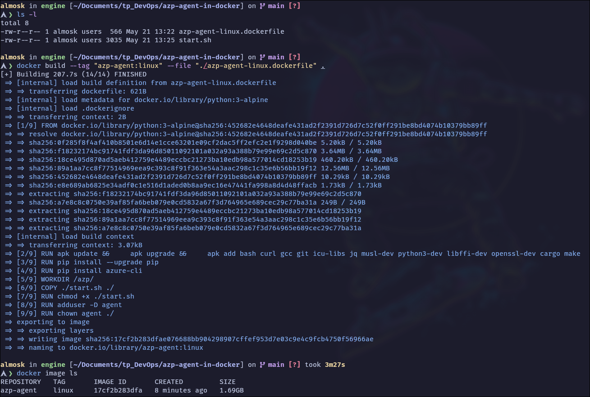
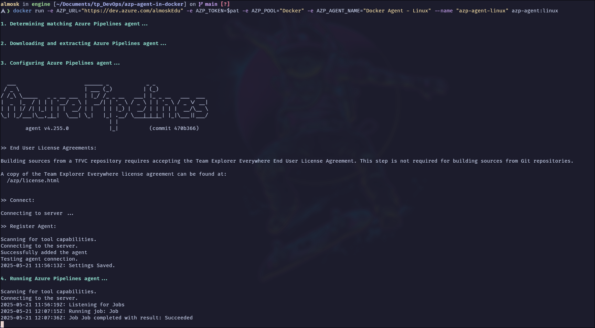
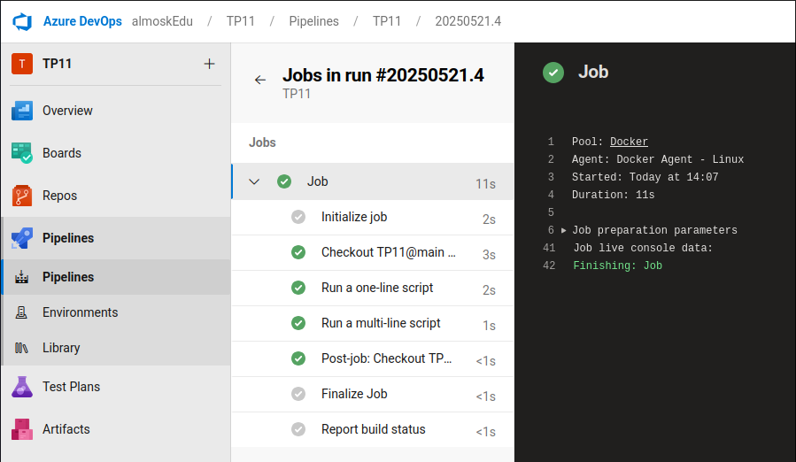

# Mise en place d'un agent Azure DevOps dans un conteneur Docker

*Dans l'absence de la parallélisation des builds sur Azure DevOps. J'ai décidé de créer mon propre agent en me basant sur sur cette documentation Microsoft : https://learn.microsoft.com/fr-fr/azure/devops/pipelines/agents/docker?view=azure-devops*

## Mise en place de l'agent

### 1. Ajout de la configuration de l'agent

En me basant sur la documentation, j'ai créer et importer le code de [azp-agent-linux.dockerfile(azp-agent-linux.dockerfile)](azp-agent-linux.dockerfile) et [start.sh](start.sh) dans le répertoire `azp-agent-in-docker`.

### 2. Création de l'image Docker

Toujours en me basant sur la documentation, j'ai créer l'image Docker avec les commandes suivantes :

```bash
docker build --tag "azp-agent:linux" --file "./azp-agent-linux.dockerfile" .
```



Il n'y a plus que à lancer l'agent en adaptant la commande de la documentation :

```bash
docker run -e AZP_URL="https://dev.azure.com/almoskEdu" -e AZP_TOKEN=$pat -e AZP_POOL="Docker" -e AZP_AGENT_NAME="Docker Agent - Linux" --name "azp-agent-linux" azp-agent:linux
```
*`$pat` contient le token d'autentification de l'agent.*

### 3. Lancement de l'agent

L'agent est maintenant lancé et reçois mon job de test.




